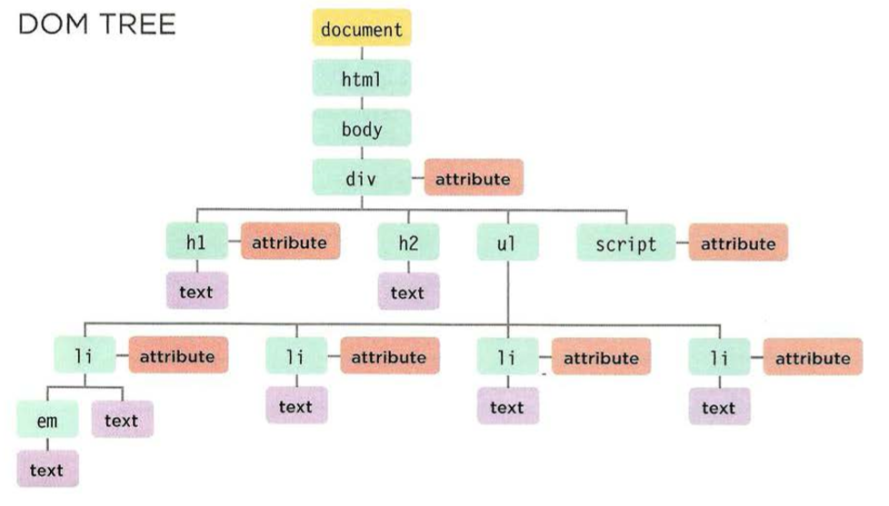

# Chapter 3: “Object Literals”

### WHAT IS AN OBJECT?

Objects group together a set of variables and functions to create a model of a something you would recognize from the real world. In an object, variables and functions take on new names.<br>

> IN AN OBJECT:

- VARIABLES BECOME KNOWN AS PROPERTIES.
- FUNCTIONS BECOME KNOWN AS METHODS.

+ For example:
```
var hotel = {
  name : 'Quay',
  rooms : 40,
  booked : 25,
  gym : true,
  roomTyps : ['twin', 'double', 'suite'],

  checkAvailability : function(){
    return this.rooms - this.booked;
  }
};
```

***Object***:
+ hotel

***Properties***:
=> key : value
- `name : 'Quay'`
+ `rooms : 40,`
* `booked : 25,`
+ `gym : true,`
* `roomTyps : ['twin', 'double', 'suite']`

***Method***:
```
checkAvailability : function(){
  return this.rooms - this.booked;
}
```

### Accessing an object and DOT notation:

you access the properties or methods of an object using dot notation. You can also access properties using square brackets.<br>

```
var hotalName = hotel.name;
var roomsFree = hotel.checkAvailability();

// OR

var hotelName = hotel['name'];
```

### Creating an object: Constructor notation:

The **new** keyword and the object constructor create a blank object. You can then add properties and methods to the object.<br>

` var hotel = new Object();`

***to Update an object***:

To **update** the value of properties, ***use dot notation or square brackets***. They work on objects created using literal or constructor notation.<br> 
To **Delete** a property, ***use the delete keyword***.<br>

* `hotel.name = 'Park';`
- `hotal['name'] = 'Park';`
+ `delete hotal.name;`
+ `hotal.name = '';`


# Chapter 5: “Document Object Model” 

The Document Object Model (DOM) specifies how browsers should create a model of an HTML page and how JavaScript can access and update the contents of a web page while it is in the browser window.<br>

> Body of the HTML page:

```
<html>
 <body>
  <div id="page"> 
    <hl id="header">List</hl> 
    <h2>Buy groceries</h2> 
    <ul>
      <li id="one" class="hot"><em>fresh</em> figs</li> 
      <li id="two" class="hot">pine nuts</l i> 
      <li id="three" class="hot">honey</li> 
      <li id="four">balsamic vinegar</li> 
    </ul > 
    <script src="js/l i st.js"></scri pt>
  </div> 
  </ body> 
</html > 
```

> DOM Tree:



- **Attribute Nodes**:<br>
The opening tags of HTML elements can carry attributes and these are represented by attribute nodes in the DOM tree.<br>
Attribute nodes are not children of the element thar carries them; they are part of that element.<br>


- **Text Node**:<br>
Once you have accessed an element node, you can then reach the text within that element. This is stored in its own text node.<br>
Text nodes cannot have children. If an element contains text and another child element, the child element is not a child of the text node but rather a child of the containing element.<br>


### Methods that select individual elements:

`getElementById()` and `querySelector()` can both search an entire document and return individual elements. **Both use a similer syntax**.<br>

> When a DOM method can return more than one element, it returns a Nodelist (even if it only finds one matching element). 


* We can select element using:<br>
1. ID Attributes:<br>
`document.getElementById('idName')`<br>
1. Tag Name:<br>
`document.getElementsByTagName('hl')`<br>
1. Class Name:<br>
`document.getElementsByClassName('className')`<br>
1. All Element:<br>
`document.querySelectorAll()`<br>


### ACCESS & UPDATE TEXT WITH TEXTCONTENT (& INN ERTEXT):

1. textContent<br>
1. innerText<br>

### ADDING ELEMENTS USING DOM MANIPULATION:

1. `createElement()`:<br>
When the element node is created, it is not yet part of the DOM tree. It is not added to the DOM tree until step 3.<br>
- For example: `var newEl document.createElement( 'li ');`

1. `createTextNode()`:<br>
This provides the content for the element, although you can skip this step if you want to attach an empty element to the DOM tree.<br>
- For example: `var newText document.createTextNode( 'quinoa ' );`

1. `appendChild()`:<br>
The appendChild() method allows you to specify which element you want this node added to, as a child of it.<br>
- For example: `newEl.appendChild(newText); `


### REMOVING AN ELEMENT FROM THE DOM TREE:

To remove elements from the DOM tree we can use `removeChild()` method to remove elemnets (along with its contents). 


### Attribute Nodes:

Once you have an element node, you can use other properyies and methods on that element node to access and change its attributes. using `getattribute('attributeName')`<br>

**To change the attribute value**:<br>
`setAttribute('attributeName','newValue')`, method allows you to update the value of any attribute. It takes two parameters: the attribute name, and the value for the attribute. <br>

**To remove the attribute**:<br>
To remove an attribute from an element, first select the element, then call `removeAttribute('attributeName')`. It has one parameter: the name of the attribute to remove


