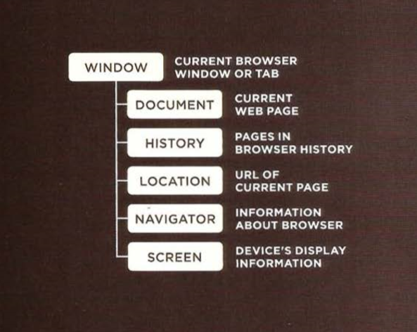

# Chapter 6: “Tables”

A table represents information in a grid format. Examples of tables include financial reports, TV schedules, and sports results.<br>

> Basic Table structure:

`<table>`<br>
The `<table>` element is used to create a table. The contents of the table are written out row by row.<br>
`<tr>`<br>
You indicate the start of each row using the opening `<tr>` tag. (The tr stands for table row.) 
It is followed by one or more `<td>` elements (one for each cell in that row). 
At the end of the row you use a  closing `</tr>` tag.<br>
`<td>`<br>
Each cell of a table is represented using a `<td>` element. (The td stands for table data.)
At the end of each cell you use a closing `</td>` tag.<br>

> index.html
```
<table>
  <tr>
      <td>15</td>    
      <td>15</td>
      <td>30</td>
  </tr>  
  <tr>
      <td>45</td>    
      <td>60</td>    
      <td>45</td>  
  </tr>  
  <tr>
      <td>60</td>    
      <td>90</td>    
      <td>90</td>  
  </tr> 
</table>
```
> browser

15 15 30<br>
45 60 54<br>
60 90 90<br>

### spanning columns:

The colspan attribute can be used on a `<th>` or `<td>` element and indicates how many **columns** that cell should run across.<br>

### spanning roWs:

The rowspan attribute can be used on a `<th>` or `<td>` element to indicate how many **rows** a cell should span down the 
table.<br>

### WidTh & spacing:

The opening `<table>` tag could also use the **cellpadding** attribute to add space inside each cell of the table, and the **cellspacing** attribute to create space between each cell of the table. The values for these attributes were given in pixels.<br>

### border & background:

The **border** attribute was used on both the `<table>` and `<td>` elements to indicate the width of the border in pixels.
The **bgcolor** attribute was used to indicate background colors of either the entire table or individual table cells. The value is usually a hex code.<br>


# Chapter 3: “Functions, Methods, and Objects”

> CREATING OBJECTS USING CONSTRUCTOR SYNTAX:

`var hotel = new Object();`<br>

- To create properties for the object:<br>
```
hotel.name= 'Park'; 
hotel.rooms = 120; 
hotel.booked = 77; 
hotel.checkAvailability = function() {
  return this.rooms - this.booked; 
};
```

> CREATE & ACCESS OBJECTS CONSTRUCTOR NOTATION:

constructor function defines a template for the hotels. Next, two different instances of this type of hotel object are created. The first represents a hotel called Quay and the second a hotel called Park. 
Having created instances of these objects, you can then access their properties and methods using the same dot notation that you use with all other objects.<br>

```
function Hotel (name, rooms, booked) {
  this.name = name; 
  this.rooms = rooms; 
  this.booked = booked; 
  this.checkAvailability = function(){
      return this.rooms - this.booked;
  }; 


var quayHotel = new Hotel('Quay', 40, 25);
var parkHotel = new Hotel( 'Park', 120, 77); 
```

> ADDING AND REMOVING PROPERTIES:

Once you have created an object (using literal or constructor notation), you can add new properties to it.<br>
The hotel object is given two extra properties that show the facilities (whether or not it has a gym and/or a pool). These properties are given values that are Booleans (true or false). <br>
Having added these properties to the object, you can access them just like any of the objects other properties. Here, they update the value of the cl ass attribute on their respective elements to show either a check mark or a cross mark. 
To delete a property, you use the keyword delete, and then use dot notation to identify the property or method you want to remove from the object. <br>
In this case, the booked property is removed from the object.<br>

```
var hotel = { 
  name : 'Park' , 
  rooms : 120, 
  booked : 77
}; 
hotel.gym = true; 
hotel .pool = fal se; 
delete hotel .booked; 
```

> WAYS TO CREATE OBJECTS:

1. CREATE THE OBJECT, THEN ADD PROPERTIES & METHODS.
1. CREATING AN OBJECT WITH PROPERTIES & METHODS.


> THIS (IT IS A KEYWORD):

The keyword this is commonly used inside functions and objects. Where the function is declared alters what this means. It always refers to one object, usually the object in which the function operates. <br>

> A METHOD OF AN OBJECT:

When a function is defined inside an object, it becomes a method. In a method, this refers to the containing object.<br>

> FUNCTION EXPRESSION AS METHOD

If a named function has been defined in global scope, and it is then used as a method of an object, this refers to the object it is contained within.<br>


### Three groups of bulit-in objects:



### THE BROWSER OBJECT MODEL: THE WINDOW OBJECT:

<br>
<br>

**PROPERTY** |**DESCRIPTION** 
--- | --- 
|`window. innerHeight`| Height of window (excluding browser chrome/user interface) (in pixels) 
|`window.innerWidth`|Width of window (excluding browser chrome/user interface) (in pixels)
|`window.location`|Current URL of window object (or local file path)
|`window.document`|Reference to document object, which is used to represent the current page contained in window

<br>
<br>

**METHOD** |**DESCRIPTION** 
--- | ---
|`window.alert()`| Creates dialog box with message (user must click OK button to close it).
|`window. open ()`|Opens new browser window with URL specified as parameter.


### THE DOCUMENT OBJECT:

<br>
<br>

**PROPERTY** |**DESCRIPTION** 
--- | ---
|`document.title `| Title of current documen.
|`document.URL`|Returns string containing URL of current document .

<br>
<br>

**METHOD** |**DESCRIPTION** 
--- | ---
|`document.write()`| Writes text to document .
|`document. getElementByld()`|Returns element, if there is an element with the value of the id attribute that matches.
|`document. querySe 1ectorA11 ()`|Returns list of elements that match a CSS selector, which is specified as a paramete.
|`document.createElement()`| Creates new element.
|`document.createTextNode()`|Creates new text node.

