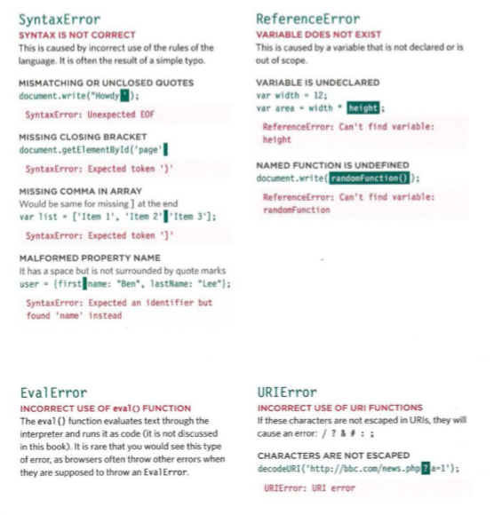
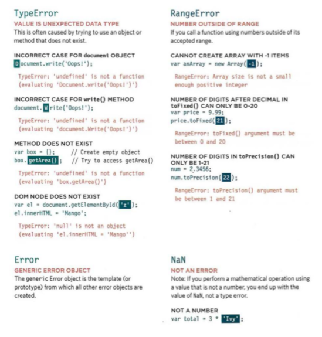
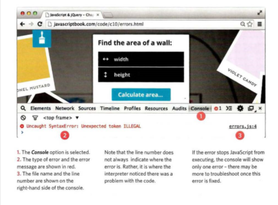
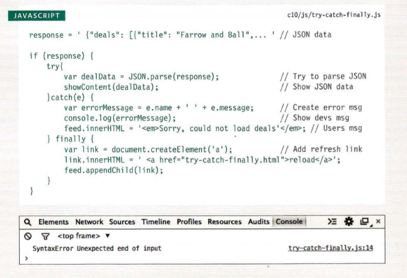

#  Chapter: 10, “Error Handling & Debugging”

### UNDERSTANDING SCOPE:

In the interpreter, each execution context has its own va ri ables object. It holds the variables, functions, and parameters available within it. Each execution context can also access its parent's v a ri ables object.<br>

### ERROR OBJECTS:

**Object** |**Descrpition** 
--- | ---
|`Error  `|  Generic error - the other errors are all based upon this error .
|`Syntax Error  `| Syntax has not been followed.
|`Ref erenceError  `| Tried to reference a variable that is not declared/within scope . 
|`TypeError  `|  An unexpected data type that cannot be coerced .
|`RangeError  `| Numbers not in acceptable range.
|`URLError  `| encodeURI ().decodeURI(),and similar methods used incorrectl. 
|`evalError  `| eva l () function used incorrectly .

<br><br>

These two pages show JavaScript's seven different types of error objects and some common examples of the kinds of errors you are likely to see. As you can tell, the errors shown by the browsers can be rather cryptic. <br><br>

<br><br>


### HOW TO LOOK AT ERRORS IN CHROME:

The console will show you when there is an error in your JavaScript. It also displays the line where it became a problem for the interpreter.<br>

<br><br>


### HANDLING EXCEPTIONS:

If you know your code might fail, use try, catch, and finally. Each one is given its own code block.<br>

```
try { 
  // Try to execute this code catch
} (exception) { 
  // If there is an exception, run this code
} finally { 
  // This always gets executed
}
```

> Try :


First, you specify the code that you think might throw an exception within the try block. 
If an exception occurs in this section of code, control is automatically passed to the corresponding catch block. 
The try clause must be used in this type of error handling code, and it should always have either a catch, fi na 1 ly, or both. 

If you use a continue, break, or return keyword inside a try, it will go to the f i na 11 y option. 

> Catch :

If the try code block throws an exception, catch steps in with an alternative set of code. 
It has one parameter: the error object. Although it is optional, you are not handling the error if you do not catch an error. 
The ability to catch an error can be very helpful if there is an issue on a live website. 
It lets you tell users that something has gone wrong (rather than not informing them why the site stopped working)

> Finaly ;

The contents of the fi na 11 y code block will run either way - whether the try block succeeded or failed. 
It even runs if a return keyword is used in the try or catch block. It is sometimes used to clean up after the previous two clauses. 
These methods are similar to the .done(), . fail(), and . a1  ways() methods in jQuery. 
You can nest checks inside each other (place another t ry inside a catch), but be aware that it can affect performance of a script. <br><br>


<br><br>


