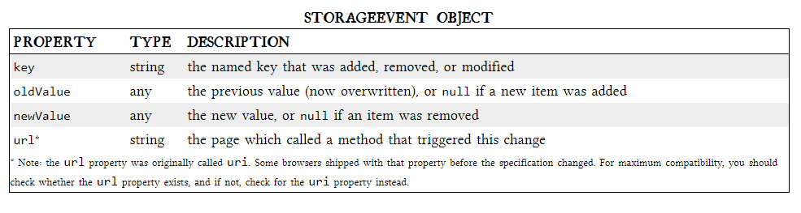

# THE PAST, PRESENT & FUTURE OF LOCAL STORAGE FOR WEB APPLICATIONS


In 2007, Google launched Gears, an open source browser plugin aimed at providing additional capabilities in browsers. Gears provides an API to an embedded SQL database based on SQLite. After obtaining permission from the user once, Gears can store unlimited amounts of data per domain in SQL database tables.<br>

## INTRODUCING HTML5 STORAGE

So what is HTML5 Storage? Simply put, it’s a way for web pages to store named key/value pairs locally, within the client web browser. Like cookies, this data persists even after you navigate away from the web site, close your browser tab, exit your browser, or what have you. Unlike cookies, this data is never transmitted to the remote web server (unless you go out of your way to send it manually). Unlike all previous attempts at providing persistent local storage, it is implemented natively in web browsers, so it is available even when third-party browser plugins are not.<br>

From your JavaScript code, you’ll access HTML5 Storage through the `localStorage` object on the global `window object`. Before you can use it, you should detect whether the browser supports it.<br>

> check for HTML5 Storage

```
function supports_html5_storage() {
  try {
    return 'localStorage' in window && window['localStorage'] !== null;
  } catch (e) {
    return false;
  }
}
```

Instead of writing this function yourself, you can use Modernizr to detect support for HTML5 Storage.<br>

```
if (Modernizr.localstorage) {
  // window.localStorage is available!
} else {
  // no native support for HTML5 storage :(
  // maybe try dojox.storage or a third-party solution
}
```

## USING HTML5 STORAGE

HTML5 Storage is based on named key/value pairs. You store data based on a named key, then you can retrieve that data with the same key. The named key is a string. The data can be any type supported by JavaScript, including strings, Booleans, integers, or floats. However, the data is actually stored as a string. If you are storing and retrieving anything other than strings, you will need to use functions like parseInt() or parseFloat() to coerce your retrieved data into the expected JavaScript datatype.<br>

```
interface Storage {
  getter any getItem(in DOMString key);
  setter creator void setItem(in DOMString key, in any data);
};
```

Calling `setItem()` with a named key that already exists will silently overwrite the previous value. Calling `getItem()` with a non-existent key will return `null` rather than throw an exception.

Like other JavaScript objects, you can treat the `localStorage` object as an associative array. Instead of using the `getItem()` and `setItem()` methods, you can simply use square brackets. For example, this snippet of code:<br>

```
var foo = localStorage.getItem("bar");
// ...
localStorage.setItem("bar", foo);
```

…could be rewritten to use square bracket syntax instead:<br>

```
var foo = localStorage["bar"];
// ...
localStorage["bar"] = foo;
```

There are also methods for removing the value for a given named key, and clearing the entire storage area (that is, deleting all the keys and values at once).<br>

```
interface Storage {
  deleter void removeItem(in DOMString key);
  void clear();
};
```

Calling `removeItem()` with a non-existent key will do nothing.<br>

Finally, there is a property to get the total number of values in the storage area, and to iterate through all of the keys by index (to get the name of each key).<br>

```
interface Storage {
  readonly attribute unsigned long length;
  getter DOMString key(in unsigned long index);
};
```

If you call `key()` with an index that is not between 0–(length-1), the function will return `null`.


## TRACKING CHANGES TO THE HTML5 STORAGE AREA

```
if (window.addEventListener) {
  window.addEventListener("storage", handle_storage, false);
} else {
  window.attachEvent("onstorage", handle_storage);
};
```

The `handle_storage` callback function will be called with a `StorageEvent` object, except in Internet Explorer where the event object is stored in `window.event`.<br>

```
function handle_storage(e) {
  if (!e) { e = window.event; }
}
```

At this point, the variable e will be a StorageEvent object, which has the following useful properties.<br>



The `storage` event is not cancelable. From within the `handle_storage` callback function, there is no way to stop the change from occurring. It’s simply a way for the browser to tell you, “hey, this just happened. There’s nothing you can do about it now; I just wanted to let you know.”<br>


## FURTHER READING


+ HTML5 storage:

[HTML5 Storage](https://w3c.github.io/webstorage/) specification.<br>

[Introduction to DOM Storage](https://msdn.microsoft.com/en-us/library/cc197062(VS.85).aspx) on MSDN.<br>

[Web Storage: easier, more powerful client-side data storage](https://dev.opera.com/articles/web-storage/) on Opera Developer Community.<br>

[DOM Storage](https://developer.mozilla.org/en-US/docs/Web/API/Web_Storage_API) on Mozilla Developer Center. (Note: most of this page is devoted to Firefox’s prototype implementation of a globalStorage object, a non-standard precursor to localStorage. Mozilla added support for the standard localStorage interface in Firefox 3.5.)<br>

[Unlock local storage for mobile Web applications with HTML5](http://www.ibm.com/developerworks/xml/library/x-html5mobile2/), a tutorial on IBM DeveloperWorks.<br>

- Early work by Brad Neuberg et. al. (pre-HTML5):<br>

[Internet Explorer Has Native Support for Persistence?!?!](http://codinginparadise.org/weblog/2005/08/ajax-internet-explorer-has-native.html) (about the userData object in IE).<br>

[Dojo Storage](https://docs.google.com/document/d/11rbFKnr2_1rkpblQ9X-zyqxCsEHrDgHm1m1oTFK34PU/preview#dojo_storage), part of a larger tutorial about the (now-defunct) Dojo Offline library.<br>

[dojox.storage.manager API reference](http://api.dojotoolkit.org/jsdoc/HEAD/dojox.storage.manager).<br>

[dojox.storage](http://svn.dojotoolkit.org/src/dojox/trunk/storage/) Subversion repository.<br>

* Web SQL Database:<br>

[Web SQL Database](http://svn.dojotoolkit.org/src/dojox/trunk/storage/) specification.<br>

[Introducing Web SQL Databases](https://dev.w3.org/html5/webdatabase/).<br>

[Web Database demonstration](http://html5demos.com/database).<br>

[persistence.js](http://zef.me/2774/persistence-js-an-asynchronous-javascript-orm-for-html5gears), an “asynchronous JavaScript ORM” built on top of Web SQL Database and Gears.<br>

+ IndexedDB:<br>

[Indexed Database API](http://dev.w3.org/2006/webapi/IndexedDB/) specification.<br>
[Beyond HTML5: Database APIs and the Road to IndexedDB](http://hacks.mozilla.org/2010/06/beyond-html5-database-apis-and-the-road-to-indexeddb/).<br>
[Firefox 4: An early walk-through of IndexedDB](https://hacks.mozilla.org/2010/06/comparing-indexeddb-and-webdatabase/).<br>


